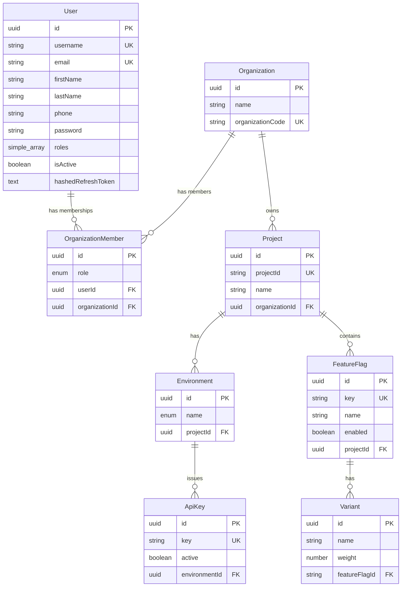
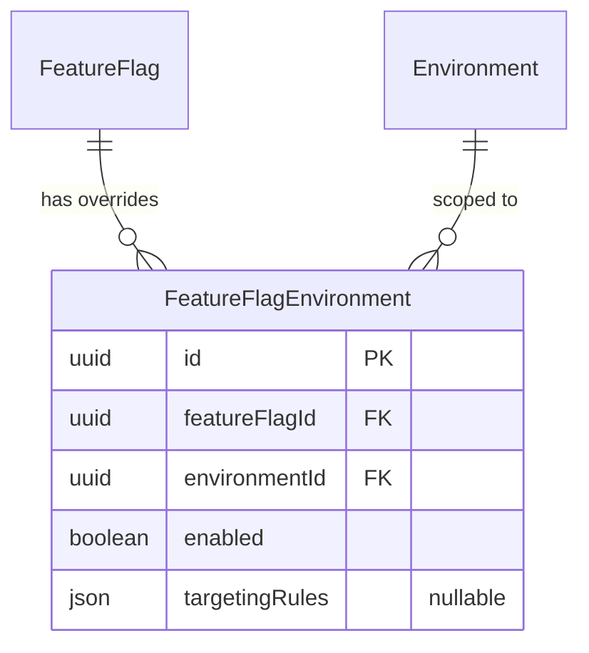
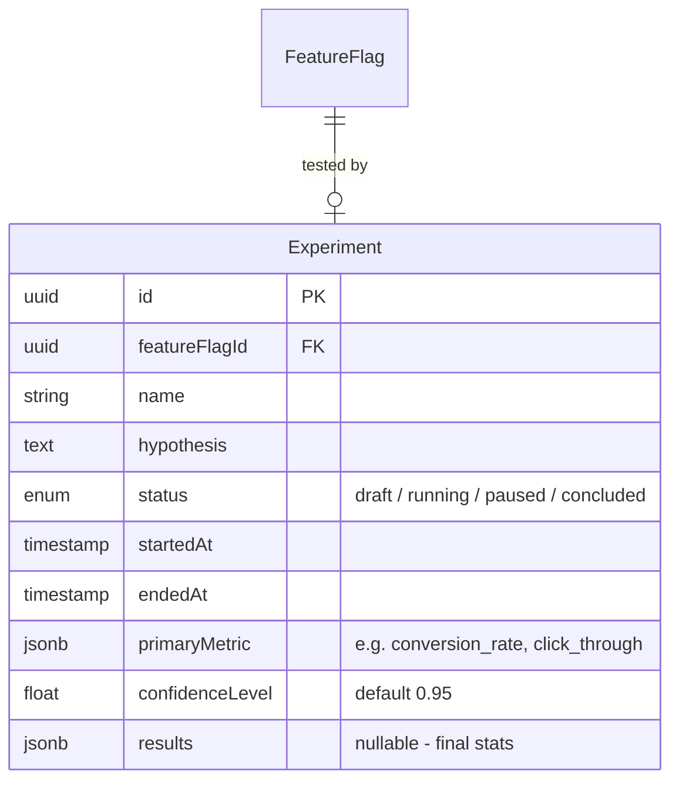
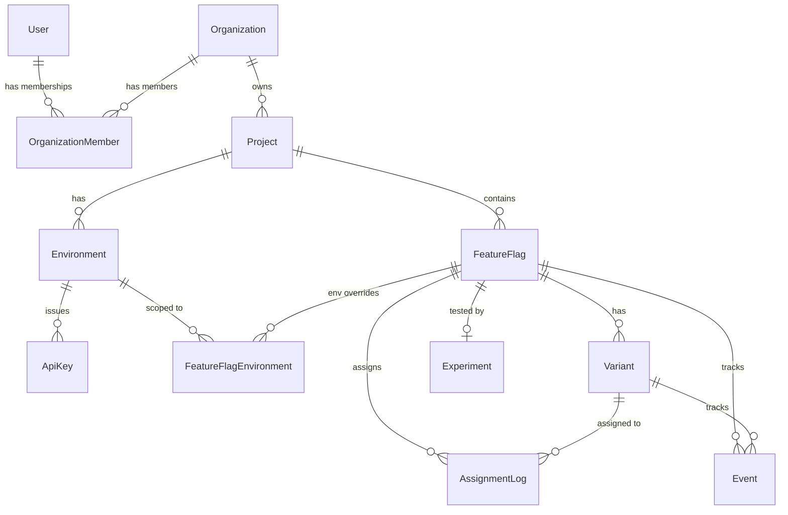

# Database Relationships & Improvement Suggestions

## Current Entity-Relationship Diagram



---

## Current Issues Found

### 1. `Environment` entity does not extend `BaseEntity`

[environment.entity.ts](file:///d:/projects/a_b_testing/server/src/modules/project/entities/environment.entity.ts) — missing `extends BaseEntity`, so it has **no `id`, `createdAt`, or `updatedAt` columns**.

### 2. `OrganizationMember.roles` should be an array

[organization.member.entity.ts](file:///d:/projects/a_b_testing/server/src/modules/organizations/entities/organization.member.entity.ts) — the column is named `roles` but typed as a single `Role` enum, not `Role[]`. Should match the naming or be changed to `role`.

### 3. `Variant.weight` needs constraints

[variant.entity.ts](file:///d:/projects/a_b_testing/server/src/modules/feature_flag/entities/variant.entity.ts) — no validation that variant weights within a single feature flag sum to 100 (or 1.0). No column type specified (`float` vs `int`).

### 4. `FeatureFlag.key` uniqueness scope

[feature.flag.entity.ts](file:///d:/projects/a_b_testing/server/src/modules/feature_flag/entities/feature.flag.entity.ts) — `key` is globally unique, but it should likely be unique **per project** (composite unique on `[key, projectId]`), so different projects can reuse the same flag key.

---

## Suggested Improvements

### A. Feature Flag — Assignment Algorithm Storage

> [!IMPORTANT]
> This is critical for A/B testing. The system needs to know **how** to assign users to variants.

Add an `allocationStrategy` column to the `FeatureFlag` entity to define which algorithm is used during variant assignment:

```typescript
// src/common/enums/allocation-strategy.enum.ts
export enum AllocationStrategy {
    /** Deterministic hashing (e.g. MurmurHash3 on userId + flagKey).
     *  Same user always gets the same variant. Best for most A/B tests. */
    DETERMINISTIC_HASH = 'deterministic_hash',

    /** Pure random assignment each time. Useful for session-scoped tests. */
    RANDOM = 'random',

    /** Weighted round-robin across variants. Good for gradual rollouts. */
    PERCENTAGE_ROLLOUT = 'percentage_rollout',
}
```

```typescript
// In FeatureFlag entity — add column:
@Column({
    type: 'enum',
    enum: AllocationStrategy,
    default: AllocationStrategy.DETERMINISTIC_HASH,
})
allocationStrategy: AllocationStrategy;
```

| Strategy | Use Case | Consistency |
|---|---|---|
| `deterministic_hash` | Standard A/B test — user always sees same variant | ✅ Sticky |
| `random` | Session-level experiments, canary testing | ❌ Non-sticky |
| `percentage_rollout` | Gradual feature rollouts (10% → 50% → 100%) | ✅ Sticky via hash |

---

### B. Feature Flag — Per-Environment Overrides

Currently a flag is either `enabled` or not, globally. For real-world usage, flags need **per-environment state** (on in staging, off in production).



Proposed entity:

```typescript
// feature-flag-environment.entity.ts
@Entity('feature_flag_environments')
@Unique(['featureFlag', 'environment'])
export class FeatureFlagEnvironment extends BaseEntity {
    @ManyToOne(() => FeatureFlag, flag => flag.environmentOverrides)
    featureFlag: FeatureFlag;

    @ManyToOne(() => Environment)
    environment: Environment;

    @Column({ default: false })
    enabled: boolean;

    @Column({ type: 'jsonb', nullable: true })
    targetingRules: TargetingRule[] | null;
}
```

---

### C. Targeting Rules — Who Sees Which Variant

For production-grade A/B testing, you need to define **who** is eligible. Store targeting rules as JSONB on `FeatureFlagEnvironment`:

```typescript
interface TargetingRule {
    /** e.g. 'country', 'userRole', 'email', 'userId', 'percentage' */
    attribute: string;

    /** e.g. 'in', 'not_in', 'equals', 'contains', 'gte', 'lte' */
    operator: 'in' | 'not_in' | 'equals' | 'contains' | 'gte' | 'lte';

    /** The values to match against */
    values: (string | number)[];
}
```

Example rule — "only users in India with role `developer`":
```json
[
    { "attribute": "country", "operator": "in", "values": ["IN"] },
    { "attribute": "userRole", "operator": "equals", "values": ["developer"] }
]
```

---

### D. Experiment Entity — A/B Test Lifecycle

A feature flag with variants is just the mechanism. The **Experiment** entity wraps the A/B test with lifecycle, goals, and statistical tracking:



```typescript
export enum ExperimentStatus {
    DRAFT = 'draft',
    RUNNING = 'running',
    PAUSED = 'paused',
    CONCLUDED = 'concluded',
}
```

---

### E. Assignment Log — Audit Trail

Track which user was assigned which variant for analytics and debugging:

```typescript
@Entity('assignment_logs')
@Index(['userId', 'featureFlagId'], { unique: true })
export class AssignmentLog extends BaseEntity {
    @Column()
    userId: string;

    @ManyToOne(() => FeatureFlag)
    featureFlag: FeatureFlag;

    @ManyToOne(() => Variant)
    variant: Variant;

    @Column()
    assignedAt: Date;

    @Column({ type: 'jsonb', nullable: true })
    context: Record<string, any>; // user attributes at assignment time
}
```

---

### F. Event Tracking — Measuring Results

To know if variant A beats variant B, you need event data:

```typescript
@Entity('events')
@Index(['userId', 'featureFlagId', 'eventType'])
export class Event extends BaseEntity {
    @Column()
    userId: string;

    @ManyToOne(() => FeatureFlag)
    featureFlag: FeatureFlag;

    @ManyToOne(() => Variant)
    variant: Variant;

    @Column()
    eventType: string; // e.g. 'click', 'purchase', 'signup'

    @Column({ type: 'jsonb', nullable: true })
    metadata: Record<string, any>;

    @Column({ type: 'timestamptz' })
    occurredAt: Date;
}
```

---

## Proposed Full ER Diagram (With Improvements)



---

## Summary of Immediate Fixes

| # | File | Fix |
|---|---|---|
| 1 | [environment.entity.ts](file:///d:/projects/a_b_testing/server/src/modules/project/entities/environment.entity.ts) | Add `extends BaseEntity` |
| 2 | [organization.member.entity.ts](file:///d:/projects/a_b_testing/server/src/modules/organizations/entities/organization.member.entity.ts) | Rename `roles` → `role` (single enum) |
| 3 | [variant.entity.ts](file:///d:/projects/a_b_testing/server/src/modules/feature_flag/entities/variant.entity.ts) | Use `{ type: 'decimal', precision: 5, scale: 2 }` for weight |
| 4 | [feature.flag.entity.ts](file:///d:/projects/a_b_testing/server/src/modules/feature_flag/entities/feature.flag.entity.ts) | Change `key` unique to composite `@Unique(['key', 'project'])` and add `allocationStrategy` column |
