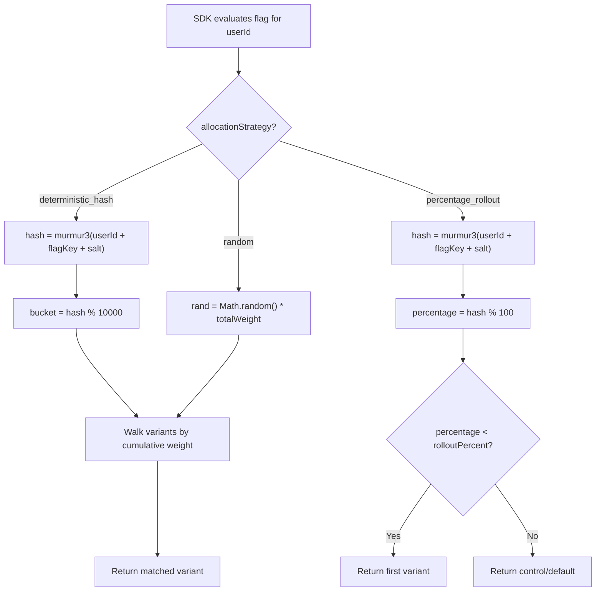
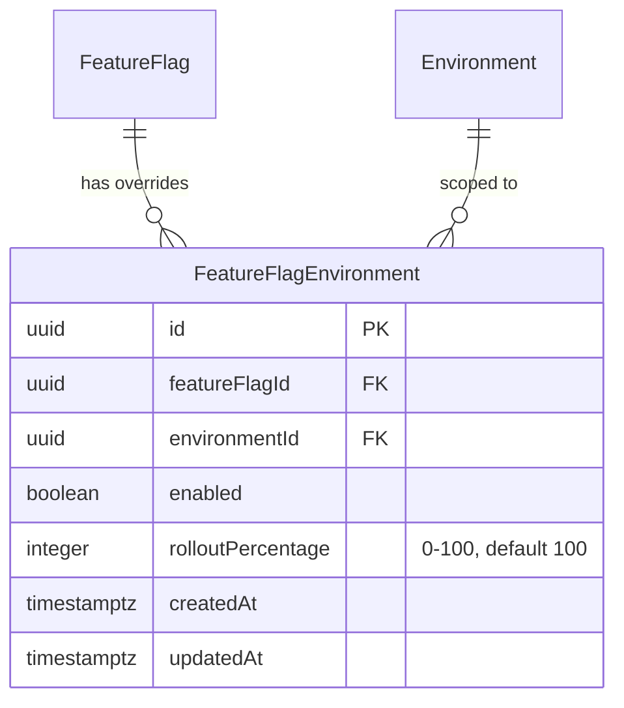
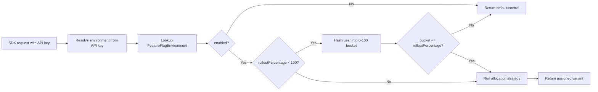
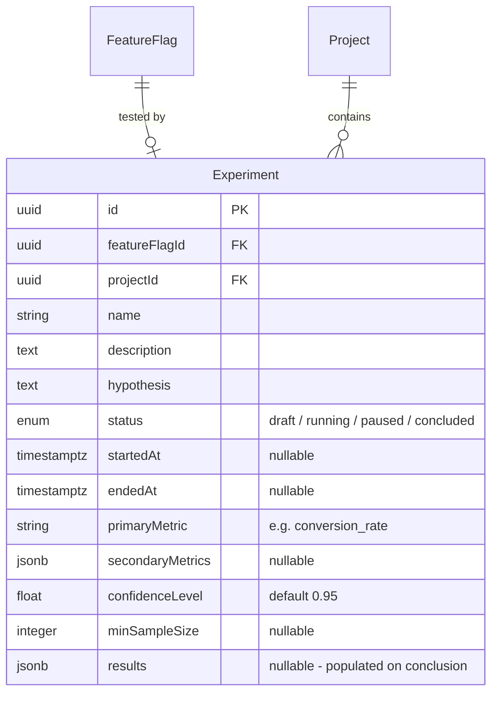
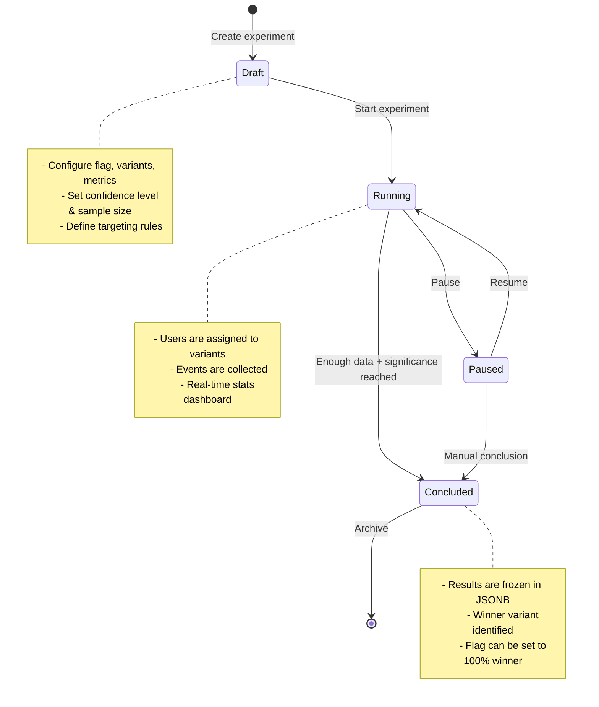
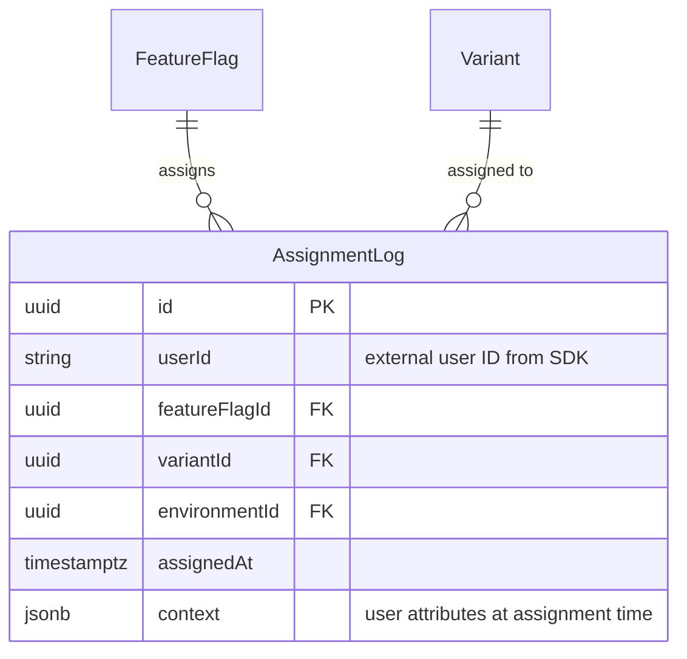
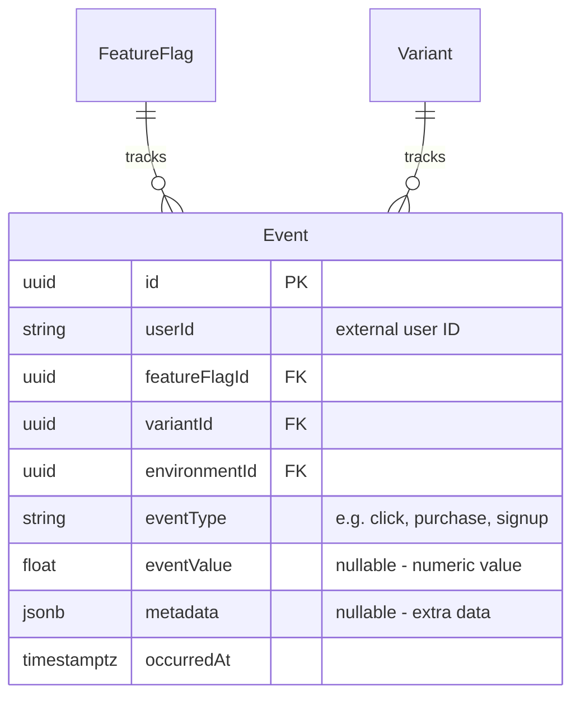
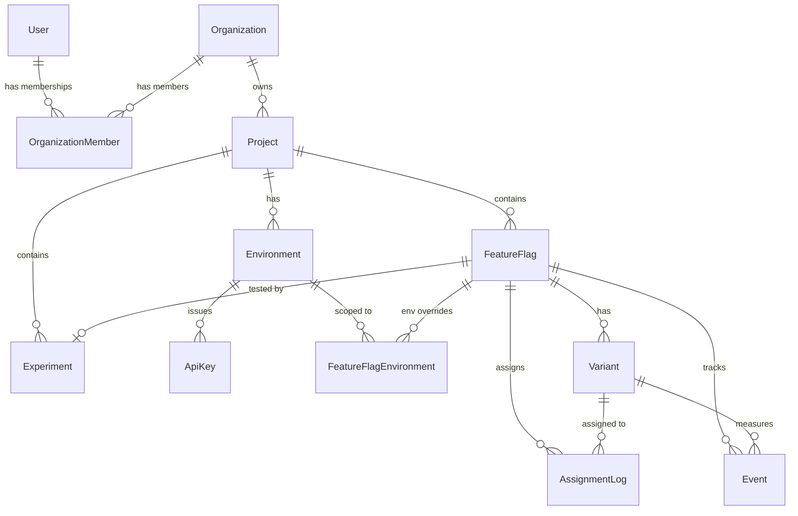
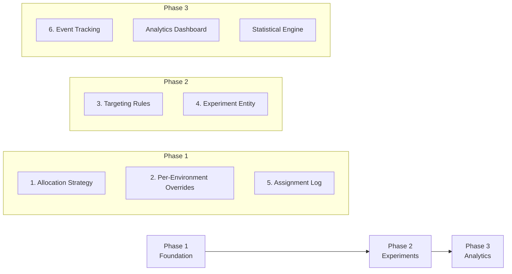

# A/B Testing Platform — Improvement Proposals

> [!NOTE]
> This document details 6 improvement proposals for the A/B testing platform's database schema and architecture. Each section includes entity designs, code examples, ER diagrams, and implementation notes.

---

## Table of Contents

1. [Allocation Strategy Storage](#1-allocation-strategy-storage)
2. [Per-Environment Overrides](#2-per-environment-overrides)
3. [Targeting Rules](#3-targeting-rules)
4. [Experiment Entity](#4-experiment-entity)
5. [Assignment Log](#5-assignment-log)
6. [Event Tracking](#6-event-tracking)
7. [Summary & Priority Matrix](#7-summary--priority-matrix)
8. [Recommended Implementation Order](#8-recommended-implementation-order)

---

## 1. Allocation Strategy Storage

### Problem

Currently, the `FeatureFlag` entity has **no way to define how users are assigned to variants**. Without this, every SDK consumer must implement their own assignment logic, leading to inconsistency and non-reproducible experiments.

### Proposed Solution

Add an `allocationStrategy` enum column to `FeatureFlag`, plus a `hashSalt` column for re-randomization support.

### Enum Definition

```typescript
// src/common/enums/allocation-strategy.enum.ts

export enum AllocationStrategy {
    /**
     * Deterministic hashing (MurmurHash3) on `userId + flagKey + salt`.
     * Same user always gets the same variant. Best for most A/B tests.
     * Guarantees consistency across sessions and devices.
     */
    DETERMINISTIC_HASH = 'deterministic_hash',

    /**
     * Pure random assignment on each evaluation.
     * Useful for session-scoped tests or canary deployments
     * where consistency is not required.
     */
    RANDOM = 'random',

    /**
     * Hash-based percentage rollout.
     * Users are bucketed deterministically into a 0-100 range.
     * Variant weights define the bucket boundaries.
     * Good for gradual rollouts (10% → 50% → 100%).
     */
    PERCENTAGE_ROLLOUT = 'percentage_rollout',
}
```

### Entity Changes

```typescript
// In feature.flag.entity.ts — add these columns:

@Column({
    type: 'enum',
    enum: AllocationStrategy,
    default: AllocationStrategy.DETERMINISTIC_HASH,
})
allocationStrategy: AllocationStrategy;

/**
 * Random salt appended to the hash input.
 * Changing the salt re-randomizes all assignments — useful when
 * you want to "reset" an experiment without deleting data.
 * Auto-generated on entity creation.
 */
@Column({ type: 'varchar', length: 32, default: () => "md5(random()::text)" })
hashSalt: string;
```

### How Each Strategy Works



### Strategy Comparison

| Strategy | Sticky? | Re-randomizable? | Best For |
|---|---|---|---|
| `deterministic_hash` | ✅ Yes — same user, same variant | ✅ Change `hashSalt` | Standard A/B tests |
| `random` | ❌ No — different each call | N/A | Session-scoped tests, canary |
| `percentage_rollout` | ✅ Yes — hash-based buckets | ✅ Change `hashSalt` | Gradual feature rollouts |

> [!TIP]
> `deterministic_hash` should be the default for ~90% of use cases. It ensures experiment integrity because a user always sees the same experience.

---

## 2. Per-Environment Overrides

### Problem

The current `FeatureFlag.enabled` is a **global boolean**. In practice, you need a flag to be:
- ✅ Enabled in **development** (for testing)
- ✅ Enabled in **staging** (for QA)
- ❌ Disabled in **production** (not yet released)

### Proposed Solution

A new `FeatureFlagEnvironment` join entity that stores per-environment flag state.

### ER Diagram



### Entity Code

```typescript
// src/modules/feature_flag/entities/feature-flag-environment.entity.ts

import { BaseEntity } from 'src/entities/base.entity';
import { Column, Entity, ManyToOne, Unique } from 'typeorm';
import { FeatureFlag } from './feature.flag.entity';
import { Environment } from 'src/modules/project/entities/environment.entity';

@Entity('feature_flag_environments')
@Unique(['featureFlag', 'environment'])
export class FeatureFlagEnvironment extends BaseEntity {

    @ManyToOne(() => FeatureFlag, flag => flag.environmentOverrides, {
        onDelete: 'CASCADE',
    })
    featureFlag: FeatureFlag;

    @ManyToOne(() => Environment, { onDelete: 'CASCADE' })
    environment: Environment;

    /** Whether the flag is active in this environment */
    @Column({ default: false })
    enabled: boolean;

    /**
     * What percentage of eligible users should see this flag.
     * 100 = fully rolled out, 0 = disabled for everyone.
     * Works in conjunction with the flag's allocationStrategy.
     */
    @Column({ type: 'int', default: 100 })
    rolloutPercentage: number;
}
```

### Relationship Addition to FeatureFlag

```typescript
// Add to feature.flag.entity.ts:

@OneToMany(
    () => FeatureFlagEnvironment,
    override => override.featureFlag,
    { cascade: true },
)
environmentOverrides: FeatureFlagEnvironment[];
```

### Evaluation Flow



> [!IMPORTANT]
> With this change, the `FeatureFlag.enabled` column becomes a **global kill switch**. If `enabled = false` on the flag itself, it's off everywhere regardless of per-environment overrides.

---

## 3. Targeting Rules

### Problem

Currently there's no way to control **who** sees a feature flag. In real A/B testing you need:
- "Only users in India"
- "Only users with role `developer`"
- "Only users who signed up after January 2025"
- "Only 20% of users matching the above"

### Proposed Solution

Store targeting rules as a **JSONB column** on `FeatureFlagEnvironment`. This keeps rules flexible and per-environment.

### Rule Structure

```typescript
// src/common/interfaces/targeting-rule.interface.ts

/**
 * A single condition that must be met.
 * Multiple conditions within a RuleGroup are ANDed together.
 */
export interface TargetingCondition {
    /** The user attribute to evaluate.
     *  e.g. 'country', 'role', 'email', 'userId', 'signupDate', 'plan' */
    attribute: string;

    /** Comparison operator */
    operator:
        | 'in'           // attribute value is in the values array
        | 'not_in'       // attribute value is NOT in the values array
        | 'equals'       // exact match
        | 'not_equals'   // not equal
        | 'contains'     // string contains
        | 'starts_with'  // string starts with
        | 'ends_with'    // string ends with
        | 'gte'          // >= (numeric/date)
        | 'lte'          // <= (numeric/date)
        | 'gt'           // >  (numeric/date)
        | 'lt'           // <  (numeric/date)
        | 'exists'       // attribute is present
        | 'not_exists';  // attribute is not present

    /** Values to compare against */
    values: (string | number | boolean)[];
}

/**
 * A group of conditions ANDed together.
 * Multiple RuleGroups are ORed — if ANY group matches, the user qualifies.
 */
export interface TargetingRuleGroup {
    conditions: TargetingCondition[];
}

/**
 * Top-level targeting configuration.
 */
export interface TargetingRules {
    /** OR groups — user matches if ANY group's conditions are ALL true */
    groups: TargetingRuleGroup[];
}
```

### Column Addition to FeatureFlagEnvironment

```typescript
// Add to feature-flag-environment.entity.ts:

/**
 * JSONB targeting rules that determine which users are eligible.
 * null = all users are eligible (no targeting).
 */
@Column({ type: 'jsonb', nullable: true })
targetingRules: TargetingRules | null;
```

### Example Rules

**"Users in India OR users with developer role"**
```json
{
    "groups": [
        {
            "conditions": [
                { "attribute": "country", "operator": "in", "values": ["IN"] }
            ]
        },
        {
            "conditions": [
                { "attribute": "role", "operator": "equals", "values": ["developer"] }
            ]
        }
    ]
}
```

**"Premium users in US who signed up after 2025-01-01"** (all conditions ANDed)
```json
{
    "groups": [
        {
            "conditions": [
                { "attribute": "country", "operator": "equals", "values": ["US"] },
                { "attribute": "plan", "operator": "in", "values": ["premium", "enterprise"] },
                { "attribute": "signupDate", "operator": "gte", "values": ["2025-01-01"] }
            ]
        }
    ]
}
```

### Evaluation Pseudocode

```
function isUserEligible(user, targetingRules):
    if targetingRules is null → return true   // no targeting = everyone
    
    for each group in targetingRules.groups:   // OR across groups
        allMatch = true
        for each condition in group.conditions: // AND within group
            if not evaluate(user, condition):
                allMatch = false
                break
        if allMatch → return true
    
    return false
```

> [!TIP]
> Keep targeting rules on `FeatureFlagEnvironment` (not on `FeatureFlag` directly) so you can target different audiences per environment — e.g., target all developers in staging, but only 10% of premium users in production.

---

## 4. Experiment Entity

### Problem

A feature flag with variants is just a **mechanism**. An A/B test needs lifecycle management:
- What are we testing? (hypothesis)
- When did it start/end?
- What metric are we measuring?
- What's the required confidence level?
- What were the results?

### Proposed Solution

A dedicated `Experiment` entity that wraps a feature flag with test metadata.

### ER Diagram



### Enum Definition

```typescript
// src/common/enums/experiment-status.enum.ts

export enum ExperimentStatus {
    /** Experiment is configured but not yet collecting data */
    DRAFT = 'draft',

    /** Actively assigning users and collecting events */
    RUNNING = 'running',

    /** Temporarily halted — no new assignments, events still recorded */
    PAUSED = 'paused',

    /** Experiment is complete — results are final */
    CONCLUDED = 'concluded',
}
```

### Entity Code

```typescript
// src/modules/experiment/entities/experiment.entity.ts

import { BaseEntity } from 'src/entities/base.entity';
import { Column, Entity, JoinColumn, ManyToOne, OneToOne } from 'typeorm';
import { FeatureFlag } from 'src/modules/feature_flag/entities/feature.flag.entity';
import { Project } from 'src/modules/project/entities/project.entity';
import { ExperimentStatus } from 'src/common/enums/experiment-status.enum';

@Entity('experiments')
export class Experiment extends BaseEntity {

    @Column({ length: 255 })
    name: string;

    @Column({ type: 'text', nullable: true })
    description: string;

    /**
     * The hypothesis being tested.
     * e.g. "Changing the CTA button color to green will increase
     *        click-through rate by at least 5%"
     */
    @Column({ type: 'text' })
    hypothesis: string;

    @Column({
        type: 'enum',
        enum: ExperimentStatus,
        default: ExperimentStatus.DRAFT,
    })
    status: ExperimentStatus;

    @Column({ type: 'timestamptz', nullable: true })
    startedAt: Date | null;

    @Column({ type: 'timestamptz', nullable: true })
    endedAt: Date | null;

    /**
     * The primary metric to evaluate.
     * e.g. 'conversion_rate', 'click_through_rate', 'revenue_per_user'
     */
    @Column({ length: 100 })
    primaryMetric: string;

    /**
     * Optional secondary metrics to track alongside.
     * e.g. ['bounce_rate', 'time_on_page', 'pages_per_session']
     */
    @Column({ type: 'jsonb', nullable: true })
    secondaryMetrics: string[] | null;

    /**
     * Statistical confidence threshold (default 95%).
     * The experiment needs to reach this confidence before
     * results are considered significant.
     */
    @Column({ type: 'decimal', precision: 4, scale: 3, default: 0.95 })
    confidenceLevel: number;

    /**
     * Minimum number of users per variant before analysis.
     * Prevents premature conclusions from small samples.
     */
    @Column({ type: 'int', nullable: true })
    minSampleSize: number | null;

    /**
     * Final results stored as JSONB when experiment concludes.
     * Structure: { variantId: { sampleSize, conversionRate, pValue, isWinner } }
     */
    @Column({ type: 'jsonb', nullable: true })
    results: Record<string, any> | null;

    // ── Relationships ──

    @OneToOne(() => FeatureFlag)
    @JoinColumn()
    featureFlag: FeatureFlag;

    @ManyToOne(() => Project)
    project: Project;
}
```

### Experiment Lifecycle



### Example Results JSON

```json
{
    "variant_a_uuid": {
        "name": "Control (Blue Button)",
        "sampleSize": 12450,
        "conversions": 623,
        "conversionRate": 0.0500,
        "pValue": null,
        "isControl": true,
        "isWinner": false
    },
    "variant_b_uuid": {
        "name": "Green Button",
        "sampleSize": 12380,
        "conversions": 742,
        "conversionRate": 0.0599,
        "pValue": 0.0023,
        "isControl": false,
        "isWinner": true,
        "uplift": "+19.8%"
    }
}
```

---

## 5. Assignment Log

### Problem

Without tracking **which user received which variant**, you cannot:
- Debug why a user saw a specific experience
- Correlate events back to variants for analysis
- Audit assignment consistency
- Detect allocation bias

### Proposed Solution

An `AssignmentLog` entity that records every user-to-variant assignment.

### ER Diagram



### Entity Code

```typescript
// src/modules/experiment/entities/assignment-log.entity.ts

import { BaseEntity } from 'src/entities/base.entity';
import { Column, Entity, Index, ManyToOne } from 'typeorm';
import { FeatureFlag } from 'src/modules/feature_flag/entities/feature.flag.entity';
import { Variant } from 'src/modules/feature_flag/entities/variant.entity';
import { Environment } from 'src/modules/project/entities/environment.entity';

@Entity('assignment_logs')
@Index(['userId', 'featureFlagId'], { unique: true })
@Index(['featureFlagId', 'variantId'])
@Index(['assignedAt'])
export class AssignmentLog extends BaseEntity {

    /**
     * The external user ID provided by the SDK consumer.
     * This is NOT a FK to the User entity — it's the end-user
     * of the customer's application.
     */
    @Column({ type: 'varchar', length: 255 })
    userId: string;

    @ManyToOne(() => FeatureFlag, { onDelete: 'CASCADE' })
    featureFlag: FeatureFlag;

    @Column()
    featureFlagId: string;

    @ManyToOne(() => Variant, { onDelete: 'SET NULL', nullable: true })
    variant: Variant;

    @Column({ nullable: true })
    variantId: string;

    @ManyToOne(() => Environment, { onDelete: 'CASCADE' })
    environment: Environment;

    @Column({ type: 'timestamptz' })
    assignedAt: Date;

    /**
     * Snapshot of user attributes at the time of assignment.
     * Useful for debugging targeting rule evaluation.
     * e.g. { country: "IN", plan: "premium", role: "developer" }
     */
    @Column({ type: 'jsonb', nullable: true })
    context: Record<string, any> | null;
}
```

### Key Design Decisions

| Decision | Choice | Reasoning |
|---|---|---|
| `userId` is a string, not FK | ✅ External ID | SDK consumers send their own user IDs — these are end-users of the customer's app, not platform users |
| Unique on `[userId, featureFlagId]` | ✅ One assignment per user per flag | Ensures deterministic experiments — a user can't be in two variants |
| `context` is JSONB | ✅ Flexible schema | User attributes vary per customer — some track country, some track plan, etc. |
| Indexed on `assignedAt` | ✅ Time-range queries | Dashboard queries like "assignments in the last 7 days" |

### Usage Pattern

```
1. SDK calls: POST /api/v1/flags/evaluate
   Body: { flagKey: "checkout_button_color", userId: "user_123", context: { country: "IN" } }

2. Server evaluates:
   - Look up flag → check environment override → check targeting rules → run allocation strategy

3. If this is a NEW assignment (no existing log for userId + flagId):
   - Insert AssignmentLog with variant, context, timestamp
   - Return assigned variant

4. If assignment EXISTS:
   - Return the previously assigned variant (sticky assignment)
```

> [!IMPORTANT]
> The AssignmentLog doubles as a **sticky assignment store** for deterministic experiments. On subsequent evaluations, look up the existing assignment first before running the allocation algorithm. This guarantees consistency even if variant weights change mid-experiment.

---

## 6. Event Tracking

### Problem

Assigning users to variants is only half the story. To determine a **winner**, you need to track what users **did** after seeing each variant:
- Did they click the button? (click event)
- Did they complete checkout? (conversion event)
- How much did they spend? (revenue event)

### Proposed Solution

An `Event` entity for flexible event ingestion, linked back to flags and variants.

### ER Diagram



### Entity Code

```typescript
// src/modules/experiment/entities/event.entity.ts

import { BaseEntity } from 'src/entities/base.entity';
import { Column, Entity, Index, ManyToOne } from 'typeorm';
import { FeatureFlag } from 'src/modules/feature_flag/entities/feature.flag.entity';
import { Variant } from 'src/modules/feature_flag/entities/variant.entity';
import { Environment } from 'src/modules/project/entities/environment.entity';

@Entity('events')
@Index(['userId', 'featureFlagId', 'eventType'])
@Index(['featureFlagId', 'variantId', 'eventType'])
@Index(['occurredAt'])
@Index(['environmentId', 'occurredAt'])
export class Event extends BaseEntity {

    /**
     * External user ID — same ID used in assignment.
     * Links this event back to the user's assigned variant.
     */
    @Column({ type: 'varchar', length: 255 })
    userId: string;

    @ManyToOne(() => FeatureFlag, { onDelete: 'CASCADE' })
    featureFlag: FeatureFlag;

    @Column()
    featureFlagId: string;

    @ManyToOne(() => Variant, { onDelete: 'SET NULL', nullable: true })
    variant: Variant;

    @Column({ nullable: true })
    variantId: string;

    @ManyToOne(() => Environment, { onDelete: 'CASCADE' })
    environment: Environment;

    /**
     * Type of event — should match the experiment's primaryMetric
     * or secondaryMetrics for analysis.
     * e.g. 'page_view', 'click', 'add_to_cart', 'purchase', 'signup'
     */
    @Column({ type: 'varchar', length: 100 })
    eventType: string;

    /**
     * Optional numeric value for the event.
     * e.g. purchase amount (49.99), time on page (120.5 seconds)
     * null for binary events like 'click' or 'signup'.
     */
    @Column({ type: 'decimal', precision: 12, scale: 4, nullable: true })
    eventValue: number | null;

    /**
     * Additional unstructured data for the event.
     * e.g. { productId: "SKU123", page: "/checkout", browser: "Chrome" }
     */
    @Column({ type: 'jsonb', nullable: true })
    metadata: Record<string, any> | null;

    @Column({ type: 'timestamptz' })
    occurredAt: Date;
}
```

### SDK Integration Example

```typescript
// Client SDK usage:
abClient.track('purchase', {
    userId: 'user_123',
    flagKey: 'checkout_button_color',
    value: 49.99,
    metadata: { productId: 'SKU-456', currency: 'USD' },
});

// This translates to:
// POST /api/v1/events
// {
//     userId: "user_123",
//     flagKey: "checkout_button_color",
//     eventType: "purchase",
//     eventValue: 49.99,
//     metadata: { productId: "SKU-456", currency: "USD" }
// }
```

### Analytics Query Examples

**Conversion rate per variant:**
```sql
SELECT
    v.name AS variant_name,
    COUNT(DISTINCT al.user_id) AS total_users,
    COUNT(DISTINCT e.user_id) AS converted_users,
    ROUND(
        COUNT(DISTINCT e.user_id)::decimal /
        NULLIF(COUNT(DISTINCT al.user_id), 0) * 100, 2
    ) AS conversion_rate
FROM assignment_logs al
LEFT JOIN events e
    ON e.user_id = al.user_id
    AND e.feature_flag_id = al.feature_flag_id
    AND e.event_type = 'purchase'
JOIN variants v ON v.id = al.variant_id
WHERE al.feature_flag_id = :flagId
GROUP BY v.name;
```

**Revenue per variant:**
```sql
SELECT
    v.name AS variant_name,
    COUNT(e.id) AS total_events,
    SUM(e.event_value) AS total_revenue,
    AVG(e.event_value) AS avg_revenue_per_event
FROM events e
JOIN variants v ON v.id = e.variant_id
WHERE e.feature_flag_id = :flagId
    AND e.event_type = 'purchase'
GROUP BY v.name;
```

> [!WARNING]
> The `events` table will grow **very fast** in production. Plan for:
> - Table partitioning by `occurredAt` (monthly or weekly)
> - Archival policy (move events older than 90 days to cold storage)
> - Consider a time-series database (TimescaleDB extension) for high-volume deployments

---

## 7. Summary & Priority Matrix

| # | Proposal | Complexity | Priority | Dependencies |
|---|---|---|---|---|
| 1 | Allocation Strategy | 🟢 Low | 🔴 Critical | None |
| 2 | Per-Environment Overrides | 🟡 Medium | 🔴 Critical | None |
| 3 | Targeting Rules | 🟡 Medium | 🟠 High | #2 (rules live on env override) |
| 4 | Experiment Entity | 🟡 Medium | 🟠 High | #1 (needs allocation strategy) |
| 5 | Assignment Log | 🟢 Low | 🔴 Critical | #1 (logs which strategy was used) |
| 6 | Event Tracking | 🟡 Medium | 🟠 High | #4, #5 (needs experiment + assignments) |

### Complete Relationship Diagram



---

## 8. Recommended Implementation Order



**Phase 1 — Foundation** (implement first):
- Allocation strategy, environment overrides, and assignment logs form the core evaluation pipeline

**Phase 2 — Experiments** (implement next):
- Targeting rules and experiment lifecycle add the A/B testing intelligence layer

**Phase 3 — Analytics** (implement last):
- Event tracking and statistical analysis complete the feedback loop
