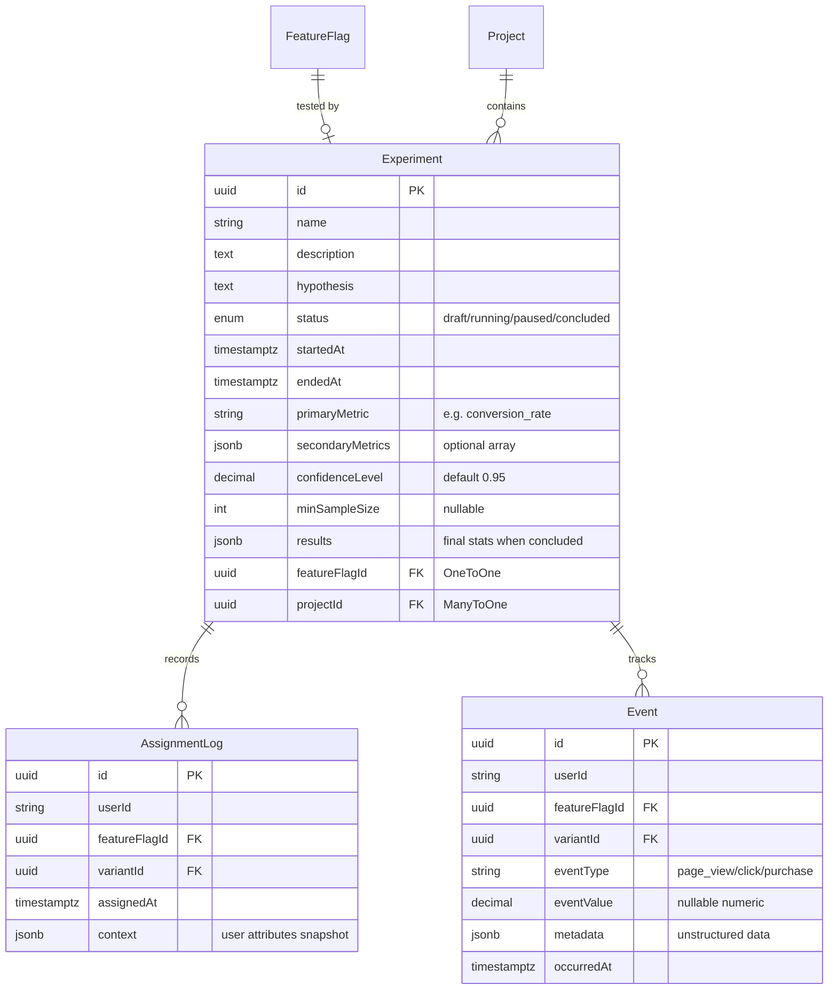
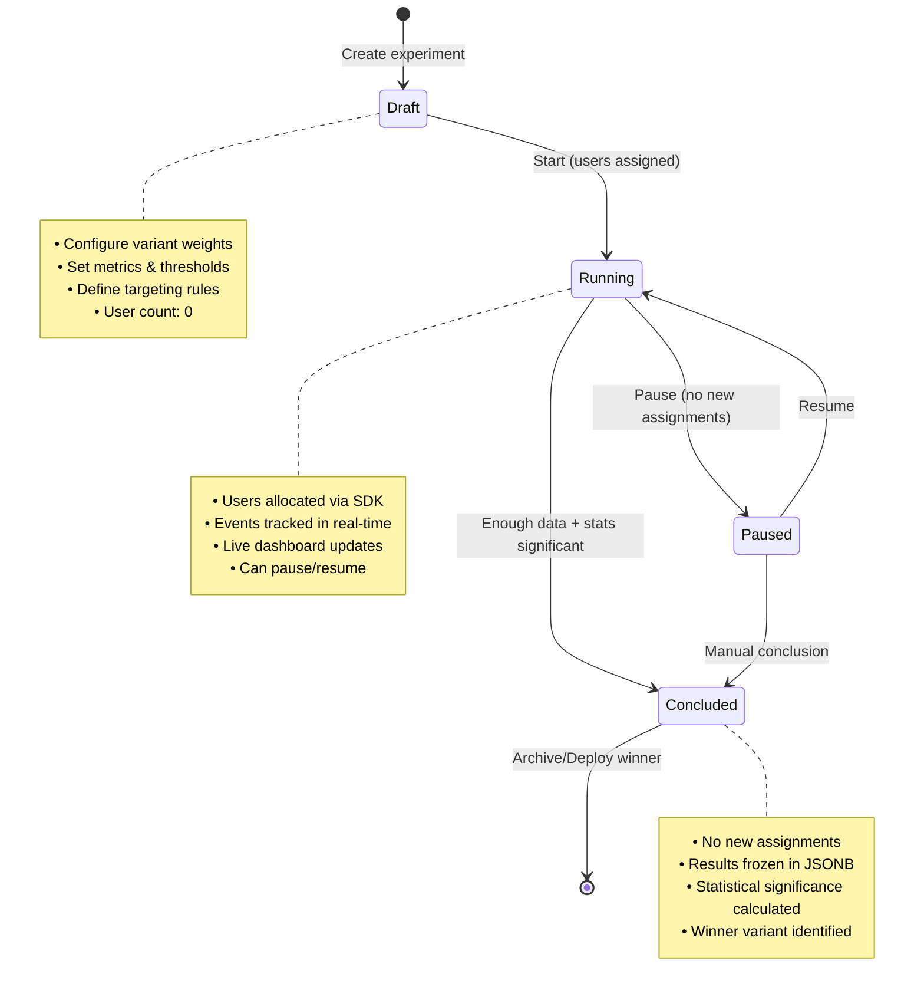

# PHASE 3 — Experiments: Database Architecture & Workflow

## Overview

The Experiment system wraps feature flags with full A/B testing lifecycle management. It tracks user assignments, collects metric events, and calculates statistical significance to determine winning variants.

---

## Database Architecture



---

## Core Entities

### 1. Experiment — The Test Container

**File:** `src/modules/experiment/entities/experiment.entity.ts`

The `Experiment` entity stores all metadata about an A/B test, including lifecycle state, metrics, statistical thresholds, and final results.

```typescript
@Entity('experiments')
export class Experiment extends BaseEntity {
    // ─── Configuration ───
    
    @Column({ length: 255 })
    name: string;  // e.g. "Checkout Button Color Test"
    
    @Column({ type: 'text', nullable: true })
    description: string;  // Optional context/notes
    
    @Column({ type: 'text' })
    hypothesis: string;  // e.g. "Changing CTA button to green increases CTR by 5%"
    
    // ─── Lifecycle State ───
    
    @Column({
        type: 'enum',
        enum: ExperimentStatus,
        default: ExperimentStatus.DRAFT,
    })
    status: ExperimentStatus;  // DRAFT → RUNNING → PAUSED → CONCLUDED
    
    @Column({ type: 'timestamptz', nullable: true })
    startedAt: Date | null;  // When users started being assigned
    
    @Column({ type: 'timestamptz', nullable: true })
    endedAt: Date | null;  // When experiment concluded
    
    // ─── Metrics ───
    
    @Column({ length: 100 })
    primaryMetric: string;  // e.g. "conversion_rate", "click_through_rate", "revenue_per_user"
    
    @Column({ type: 'jsonb', nullable: true })
    secondaryMetrics: string[] | null;  // e.g. ["bounce_rate", "time_on_page", "pages_per_session"]
    
    // ─── Statistical Thresholds ───
    
    @Column({ type: 'decimal', precision: 4, scale: 3, default: 0.95 })
    confidenceLevel: number;  // 95% = 0.95 (requires p-value < 0.05)
    
    @Column({ type: 'int', nullable: true })
    minSampleSize: number | null;  // Minimum users per variant before analysis is valid
    
    // ─── Results (populated on CONCLUDED) ───
    
    @Column({ type: 'jsonb', nullable: true })
    results: Record<string, any> | null;  // { variantA: {...}, variantB: {...} }
    
    // ─── Relationships ───
    
    @OneToOne(() => FeatureFlag)
    @JoinColumn()
    featureFlag: FeatureFlag;  // The flag being tested (1:1 relationship)
    
    @ManyToOne(() => Project)
    project: Project;  // Belongs to this project
}
```

**Key Fields:**
- `status`: Controls whether experiment is collecting assignments
- `primaryMetric`: What KPI to measure (user provides this)
- `confidenceLevel`: Statistical threshold (typically 0.95 = 95%)
- `results`: Final statistics stored as JSONB when experiment concludes

---

### 2. AssignmentLog — User Variant Bucketing

**File:** `src/modules/experiment/entities/assignment-log.entity.ts`

Audit trail of which user was assigned to which variant, when, and with what context.

```typescript
@Entity('assignment_logs')
@Index(['userId', 'featureFlagId'], { unique: true })  // One assignment per user per flag
@Index(['featureFlagId', 'variantId'])
@Index(['assignedAt'])
export class AssignmentLog extends BaseEntity {
    /**
     * External user ID from SDK consumer.
     * Not a FK to internal User entity — this is the end-user's ID.
     */
    @Column({ type: 'varchar', length: 255 })
    userId: string;
    
    @ManyToOne(() => FeatureFlag, { onDelete: 'CASCADE' })
    featureFlag: FeatureFlag;
    
    @Column()
    featureFlagId: string;
    
    @ManyToOne(() => Variant, { onDelete: 'SET NULL', nullable: true })
    variant: Variant;  // Which variant this user was assigned to
    
    @Column({ nullable: true })
    variantId: string;
    
    @Column({ type: 'timestamptz' })
    assignedAt: Date;  // When the assignment occurred
    
    /**
     * Snapshot of user attributes at assignment time.
     * Useful for debugging targeting rule evaluation.
     * e.g. { country: "IN", plan: "premium", role: "developer", isNewUser: true }
     */
    @Column({ type: 'jsonb', nullable: true })
    context: Record<string, any> | null;
}
```

**Key Design:**
- `[userId, featureFlagId]` unique constraint: Each user has exactly one assignment per flag
- `context`: Captures user attributes at assignment time for audit trail
- Enables debugging: "Why did user X get variant Y?"

---

### 3. Event — Metric Collection

**File:** `src/modules/experiment/entities/event.entity.ts`

Records every action a user takes that relates to the experiment metric (purchases, clicks, pageviews, signups, etc.).

```typescript
@Entity('events')
@Index(['userId', 'featureFlagId', 'eventType'])
@Index(['featureFlagId', 'variantId', 'eventType'])
@Index(['occurredAt'])
export class Event extends BaseEntity {
    /**
     * External user ID — same one used in AssignmentLog.
     * Links this event back to the user's assigned variant.
     */
    @Column({ type: 'varchar', length: 255 })
    userId: string;
    
    @ManyToOne(() => FeatureFlag, { onDelete: 'CASCADE' })
    featureFlag: FeatureFlag;
    
    @Column()
    featureFlagId: string;
    
    @ManyToOne(() => Variant, { onDelete: 'SET NULL', nullable: true })
    variant: Variant;  // The variant the user was assigned to
    
    @Column({ nullable: true })
    variantId: string;
    
    /**
     * Type of event — should match experiment's primaryMetric or secondaryMetrics.
     * e.g. 'page_view', 'click', 'add_to_cart', 'purchase', 'signup', 'form_submit'
     */
    @Column({ type: 'varchar', length: 100 })
    eventType: string;
    
    /**
     * Optional numeric value for the event.
     * e.g. purchase amount (49.99), time on page (120.5 seconds), rating (5)
     * null for binary events like 'click' or 'signup'.
     */
    @Column({ type: 'decimal', precision: 12, scale: 4, nullable: true })
    eventValue: number | null;
    
    /**
     * Additional unstructured data for context.
     * e.g. { productId: "SKU123", page: "/checkout", browser: "Chrome", region: "US" }
     */
    @Column({ type: 'jsonb', nullable: true })
    metadata: Record<string, any> | null;
    
    @Column({ type: 'timestamptz' })
    occurredAt: Date;  // When the event occurred
}
```

**Key Design:**
- Every event links to both the feature flag and the variant
- `eventType` must match the experiment's metric (enables aggregation)
- Multiple indexes for fast queries: user + flag + type, flag + variant + type, timestamp
- Events collected even after experiment concludes (for audit)

---

## What It Will Do

### 1. **Experiment Lifecycle Management**

Experiments progress through defined states with guardrails:



### 2. **User Assignment Tracking**

- Record which user got which variant
- Capture user context (attributes) at assignment time
- Enable audit trail: "Why did user X get variant Y?"
- Support all allocation strategies:
  - `DETERMINISTIC_HASH`: Same user always gets same variant
  - `RANDOM`: Different variant on each evaluation
  - `PERCENTAGE_ROLLOUT`: Gradual rollout via weighted hash

### 3. **Event Collection**

- Track all metric-related events (conversions, clicks, pageviews, revenue, etc.)
- Link events back to user's assigned variant
- Capture event metadata and numeric values for analysis
- Build foundation for statistical analysis

### 4. **Statistical Analysis**

- Calculate conversion rates per variant
- Compute p-values (statistical significance via Chi-Square test)
- Determine if experiment reached confidence level (default 95%)
- Identify winning variant
- Validate minimum sample size before declaring significance

### 5. **Results Storage**

Final results stored as JSONB when experiment concludes:

```json
{
  "variantA": {
    "name": "control",
    "sampleSize": 4850,
    "conversions": 485,
    "conversionRate": 0.10,
    "stdDev": 0.0095,
    "confidence": 0.95
  },
  "variantB": {
    "name": "green_button",
    "sampleSize": 4950,
    "conversions": 545,
    "conversionRate": 0.11,
    "stdDev": 0.0093,
    "confidence": 0.95
  },
  "winner": "variantB",
  "pValue": 0.032,
  "conclusion": "Statistically significant at 95% confidence level"
}
```

---

## How It Will Work

### **Phase 1: Create Experiment (DRAFT)**

Manager creates experiment via API with test metadata:

```http
POST /api/experiments
Content-Type: application/json

{
  "name": "Checkout Button Color Test",
  "hypothesis": "Changing CTA button from blue to green increases conversion by 5%",
  "description": "Testing color psychology on checkout page",
  "primaryMetric": "conversion_rate",
  "secondaryMetrics": ["click_through_rate", "avg_order_value"],
  "confidenceLevel": 0.95,
  "minSampleSize": 1000,
  "featureFlagId": "flag-uuid-checkout-button",
  "projectId": "proj-uuid-123"
}
```

**Result:** 
- Status = `DRAFT`
- No assignments happen yet
- Users still see the baseline flag behavior
- Feature flag is configured but not "live" for experiment

---

### **Phase 2: Start Experiment (DRAFT → RUNNING)**

Manager starts the experiment:

```http
POST /api/experiments/{experimentId}/start
```

**What happens:**
1. Status changes to `RUNNING`
2. `startedAt` timestamp recorded
3. Feature flag becomes "live" to SDK clients
4. SDK can now assign users to variants
5. Events collection begins

---

### **Phase 3: SDK Evaluates Flag & Assigns User**

When user visits, SDK calls:

```typescript
const result = await sdk.evaluate({
  flagKey: 'checkout-button',
  userId: 'user-12345',
  userAttributes: { 
    country: 'US', 
    plan: 'premium',
    isNewUser: false 
  }
});
```

**Server Processing:**

```
1. Look up feature flag by key
   ↓
2. Check flag.enabled (global kill switch)
   ↓
3. Check experiment status (is it RUNNING?)
   ↓
4. Evaluate targeting rules
   • Does user match targeting conditions?
   • If no match → return TARGETING_MISS
   ↓
5. Allocate user to variant
   • Check allocationStrategy:
     - DETERMINISTIC_HASH: hash(userId + flagKey + salt) % 100
     - RANDOM: Math.random() * 100
     - PERCENTAGE_ROLLOUT: weighted gradual rollout
   • Map bucket to variant by weight
   ↓
6. Record assignment to assignment_logs
   {
     userId: "user-12345",
     featureFlagId: "flag-uuid",
     variantId: "variant-uuid-green",
     assignedAt: 2025-02-15T10:30:00Z,
     context: { 
       country: "US", 
       plan: "premium", 
       isNewUser: false 
     }
   }
   ↓
7. Return variant decision to SDK
   {
     flagKey: "checkout-button",
     variant: "green_button",
     enabled: true,
     reason: "MATCH"
   }
```

**SDK renders:**
```javascript
if (result.enabled && result.variant === 'green_button') {
  // Show green button (treatment)
} else {
  // Show blue button (control)
}
```

---

### **Phase 4: User Interacts & Events Collected**

As user navigates, SDK sends events:

**User clicks button:**
```typescript
sdk.track({
  userId: 'user-12345',
  eventType: 'click',
  metadata: { button: 'checkout-cta', page: '/product/123' }
});
```

**Server records to `events` table:**
```
Event {
  id: "event-uuid-1",
  userId: "user-12345",
  featureFlagId: "flag-uuid",
  variantId: "variant-uuid-green",
  eventType: "click",
  eventValue: null,
  metadata: { button: "checkout-cta", page: "/product/123" },
  occurredAt: 2025-02-15T10:31:15Z
}
```

**User completes purchase:**
```typescript
sdk.track({
  userId: 'user-12345',
  eventType: 'purchase',
  eventValue: 49.99,
  metadata: { 
    orderId: 'ORD-456', 
    productId: 'SKU123',
    page: '/checkout/success' 
  }
});
```

**Server records:**
```
Event {
  id: "event-uuid-2",
  userId: "user-12345",
  featureFlagId: "flag-uuid",
  variantId: "variant-uuid-green",
  eventType: "purchase",
  eventValue: 49.99,
  metadata: { orderId: "ORD-456", productId: "SKU123", ... },
  occurredAt: 2025-02-15T10:35:22Z
}
```

---

### **Phase 5: Analysis & Results Calculation**

**Dashboard periodically queries:**

```sql
-- Count conversions per variant
SELECT 
  variant_id,
  variant.name,
  COUNT(DISTINCT user_id) as sample_size,
  SUM(CASE WHEN event_type = 'purchase' THEN 1 ELSE 0 END) as conversions,
  CAST(SUM(...) AS float) / COUNT(DISTINCT user_id) as conversion_rate,
  STDDEV(CASE WHEN event_type = 'purchase' THEN 1 ELSE 0 END) as std_dev
FROM events
WHERE feature_flag_id = $1
  AND event_type = $2  -- Primary metric
  AND occurred_at >= $3  -- Since experiment started
GROUP BY variant_id, variant.name;
```

**Statistical Significance Test (Chi-Square):**

```
Null Hypothesis (H0): No difference between variants
Alternative (H1): Variants have different conversion rates

Chi-Square Formula:
  χ² = Σ (Observed - Expected)² / Expected

If p-value < 0.05 (with default 0.95 confidence):
  → Reject H0: Statistically significant
  
If sample_size >= minSampleSize:
  → Results are valid
```

**Interpretation:**
```
Variant A (Control):  90% conversion rate, n=4850
Variant B (Green):    92% conversion rate, n=4950
Difference:           2 percentage points
p-value:              0.031 (< 0.05) ✅
Sample size:          4900+ per variant ✅
Conclusion:           SIGNIFICANT at 95% confidence
Winner:               Variant B (green button)
```

---

### **Phase 6: Conclude Experiment (RUNNING → CONCLUDED)**

Once statistical significance reached AND minimum sample size met:

```http
POST /api/experiments/{experimentId}/conclude
```

**What happens:**
1. Status = `CONCLUDED`
2. `endedAt` timestamp recorded
3. Final results calculated and stored in JSONB
4. Winner variant identified
5. **No new assignments allowed** (existing assignments cached)
6. Events still recorded (for audit and post-experiment analysis)

**Results stored as JSONB:**
```typescript
experiment.results = {
  variantA: {
    name: "control",
    sampleSize: 4850,
    conversions: 485,
    conversionRate: 0.10,
    stdDev: 0.0095,
    confidence: 0.95
  },
  variantB: {
    name: "green_button",
    sampleSize: 4950,
    conversions: 545,
    conversionRate: 0.11,
    stdDev: 0.0093,
    confidence: 0.95
  },
  winner: "variantB",
  pValue: 0.031,
  conclusion: "SIGNIFICANT",
  concludedAt: "2025-02-21T17:30:00Z"
}
```

---

### **Phase 7: Deploy Winner (Optional)**

Manager decides to deploy the winning variant:

**Option A: Permanent Rollout to Winner**
```http
POST /api/experiments/{experimentId}/deploy-winner

Body: { deployMode: "permanent" }
```

Effect:
```typescript
// Update feature flag variant weights
featureFlag.variants = [
  { id: "var-A", name: "control", weight: 0 },
  { id: "var-B", name: "green_button", weight: 100 }
];
```

All new users now see green button. Experiment archived in dashboard.

**Option B: Rollback to Control**
```http
POST /api/experiments/{experimentId}/rollback

Body: { deployMode: "rollback" }
```

Effect:
```typescript
// Revert to control
featureFlag.variants = [
  { id: "var-A", name: "control", weight: 100 },
  { id: "var-B", name: "green_button", weight: 0 }
];
```

---

## Complete Example Timeline

### **"Checkout Button Color Test" A/B Test**

```
├─ DAY 1 (2025-02-15)
│  ├─ 09:00 Create experiment (DRAFT)
│  │  └─ name: "Checkout Button Color Test"
│  │  └─ hypothesis: "Green button increases conversion by 5%"
│  │  └─ primaryMetric: "conversion_rate"
│  ├─ 09:15 Start experiment (RUNNING)
│  │  └─ startedAt: 2025-02-15T09:15:00Z
│  │  └─ Variant split: 50% control, 50% green
│  │  └─ Users assigned based on deterministic hash
│  └─ 10:00 First user visits
│     ├─ SDK calls evaluate("checkout-button", userId)
│     ├─ User bucketed into "green_button" variant
│     ├─ Assignment logged to assignment_logs
│     └─ User sees green button
│
├─ DAY 2-6 (Continuous Data Collection)
│  ├─ 5,000+ users assigned per variant
│  ├─ Events flowing:
│  │  ├─ "click" events when button clicked
│  │  ├─ "page_view" events for pageviews
│  │  └─ "purchase" events for conversions
│  └─ Running totals:
│     ├─ Control variant: 4,850 users, 485 conversions (10% rate)
│     └─ Green variant: 4,950 users, 545 conversions (11% rate)
│
├─ DAY 7 (2025-02-21 — Significance Reached)
│  ├─ 17:30 Dashboard calculates statistics
│  │  ├─ Sample size: 4,850+ per variant ✅ (>minSampleSize)
│  │  ├─ p-value: 0.031 ✅ (< 0.05)
│  │  ├─ Confidence: 95% ✅ (meets confidenceLevel)
│  │  └─ Winner: "green_button" (11% vs 10%, +1 percentage point)
│  ├─ 17:31 Conclude experiment (RUNNING → CONCLUDED)
│  │  ├─ status: "CONCLUDED"
│  │  ├─ endedAt: 2025-02-21T17:31:00Z
│  │  ├─ results: { variantA: {...}, variantB: {...}, winner: "variantB", pValue: 0.031 }
│  │  └─ No new assignments allowed (cached)
│  └─ 17:32 Manager notified via dashboard
│
└─ DAY 8 (2025-02-22 — Deploy Decision)
   ├─ Manager reviews results in dashboard
   ├─ Confidence: 95%, Effect size: +1%, Statistical significance: ✅
   ├─ Decision: Deploy green button to 100%
   ├─ 14:00 POST /experiments/{id}/deploy-winner
   │  ├─ Update featureFlag.variants:
   │  │  └─ green_button weight: 100%
   │  │  └─ control weight: 0%
   │  └─ All new users see green button
   └─ End result: +1% revenue lift (calculated post-deployment)
```

---

## Integration Points

| Component | Interaction | Purpose |
|-----------|-------------|---------|
| **FeatureFlag** | 1:1 OneToOne with Experiment | Defines variants & allocation strategy for experiment |
| **SDK** | Calls `/evaluate` endpoint | Retrieves variant assignment |
| **SDK Events** | Sends `/track` events | Reports user actions (clicks, purchases, etc.) |
| **Analytics Dashboard** | Queries events + assignments | Calculates stats, displays charts, determines winner |
| **Environment** | Experiments per-project | Can have per-environment configurations |
| **Targeting Rules** | On FeatureFlag | Controls which users qualify for experiment |
| **AssignmentLog** | Audit trail | Debugging: "Why did user X get variant Y?" |
| **AllocationStrategy** | On FeatureFlag | Defines how users are bucketed (deterministic/random/rollout) |

---

## Enum: ExperimentStatus

**File:** `src/common/enums/experiment-status.enum.ts`

```typescript
export enum ExperimentStatus {
    /** Experiment configured but not collecting data */
    DRAFT = 'draft',
    
    /** Actively assigning users and collecting events */
    RUNNING = 'running',
    
    /** Temporarily halted — no new assignments, events still recorded */
    PAUSED = 'paused',
    
    /** Experiment complete — results are final, no new assignments */
    CONCLUDED = 'concluded',
}
```

---

## Allocation Strategies (from FeatureFlag)

Experiments use the feature flag's allocation strategy to bucket users:

```typescript
export enum AllocationStrategy {
    /** 
     * Deterministic hashing on userId + flagKey + salt.
     * Same user always gets same variant across sessions/devices.
     * Best for most A/B tests.
     */
    DETERMINISTIC_HASH = 'deterministic_hash',
    
    /** 
     * Pure random on each evaluation.
     * User can get different variant on each pageview.
     * Use for session-scoped tests or canary deployments.
     */
    RANDOM = 'random',
    
    /** 
     * Hash-based percentage rollout.
     * Users bucketed deterministically into 0-100 range.
     * Variant weights define bucket boundaries.
     * Good for gradual rollouts: 10% → 50% → 100%.
     */
    PERCENTAGE_ROLLOUT = 'percentage_rollout',
}
```

---

## Key Design Decisions

### 1. **Event vs Assignment Separation**
- `AssignmentLog`: Records the allocation decision (once per user per flag)
- `Event`: Records user actions (many per user per flag)
- This separation enables:
  - Fast queries on assignments (unique constraint)
  - Flexible event aggregation (many events per user)
  - Audit trail of why user got variant

### 2. **User Attributes Snapshot**
- `AssignmentLog.context` captures user attributes at assignment time
- Enables debugging: "Was targeting rule correctly evaluated?"
- Useful for post-experiment analysis: "Did rule change affect results?"

### 3. **JSONB Results Storage**
- Results calculated once at conclusion
- Avoids repeated statistical calculations
- Immutable historical record: "What did the experiment show?"
- Easy to extend: Add new fields without schema change

### 4. **Soft Conclusion**
- Concluded experiments don't delete or archive data
- Events still collected after conclusion (for post-hoc analysis)
- Enables: "What if we continued the test?"

### 5. **Flexible Metrics**
- `primaryMetric` is a string (not an enum)
- Experiments can define custom metrics: "revenue_per_session", "days_to_upgrade", etc.
- `secondaryMetrics` array allows monitoring multiple KPIs

---

## Checklist: What Gets Implemented

- [x] **Experiment Entity** — Store test metadata, lifecycle, metrics, results
- [x] **Experiment Status** — DRAFT → RUNNING → PAUSED → CONCLUDED workflow
- [x] **Experiment Variants** — Variants defined by linked FeatureFlag
- [x] **Experiment Allocation** — Via FeatureFlag.allocationStrategy
- [x] **Experiment Targeting** — Via FeatureFlag.targetingRules (who qualifies)
- [x] **Experiment Lifecycle** — Start, pause, resume, conclude operations
- [x] **AssignmentLog** — Audit trail of user → variant assignments
- [x] **Event Tracking** — Record metric events (purchases, clicks, pageviews)
- [x] **Results Storage** — JSONB with winner, p-value, conversion rates

---

## Quick Reference

| Item | File | Purpose |
|------|------|---------|
| Experiment | `src/modules/experiment/entities/experiment.entity.ts` | Test container with lifecycle & metrics |
| AssignmentLog | `src/modules/experiment/entities/assignment-log.entity.ts` | User → variant audit trail |
| Event | `src/modules/experiment/entities/event.entity.ts` | Metric event tracking |
| ExperimentStatus | `src/common/enums/experiment-status.enum.ts` | Lifecycle states |
| AllocationStrategy | `src/common/enums/allocation-strategy.enum.ts` | Bucketing algorithms |
| ExperimentModule | `src/modules/experiment/experiment.module.ts` | NestJS module exports |
